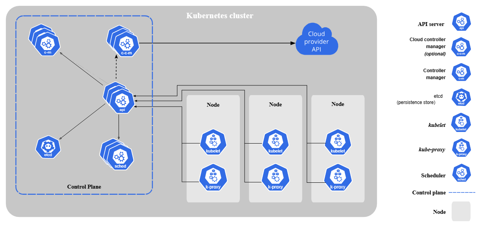
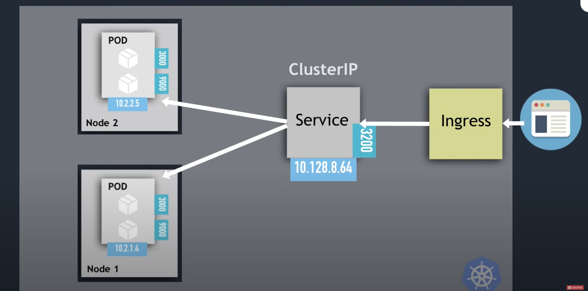
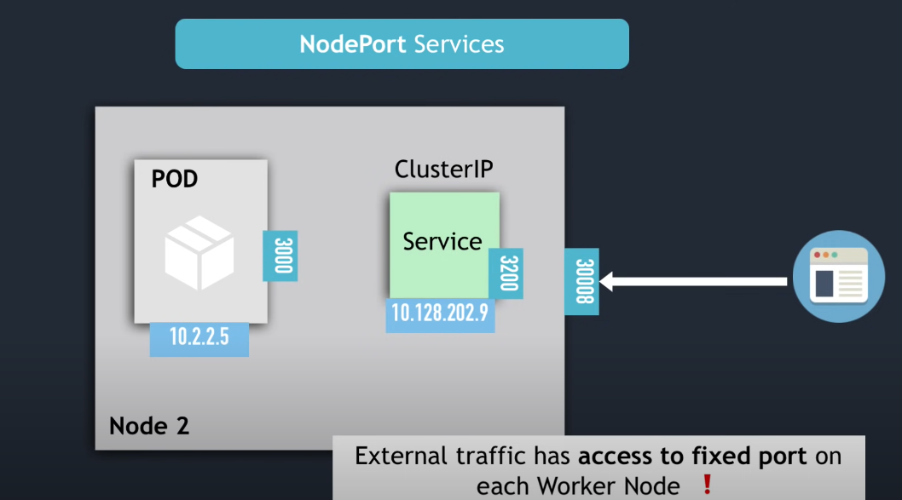
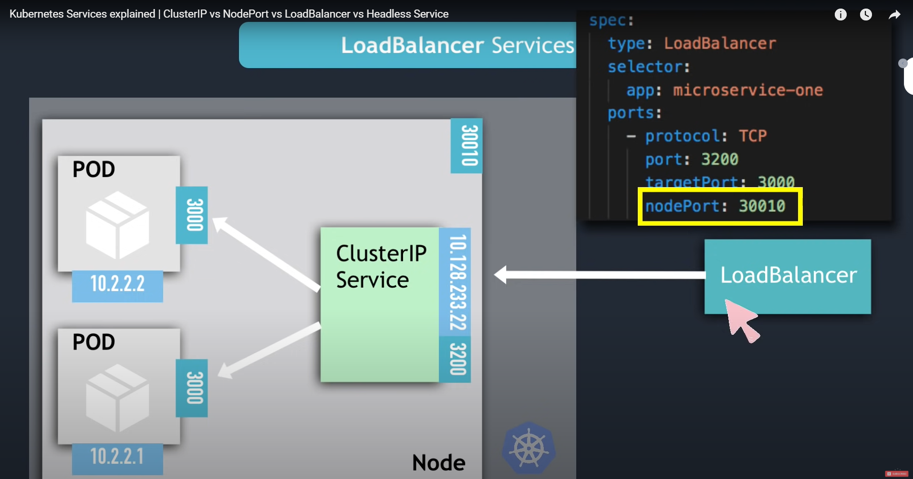
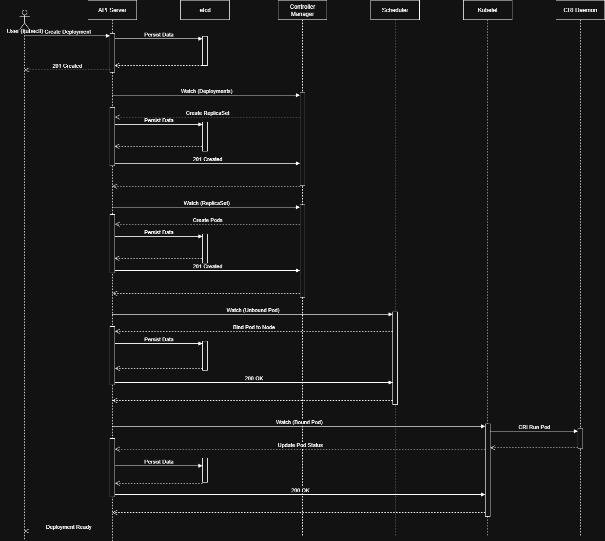

# Kubernetes
## Kubernetes Clusters
Kubernetes coordinates a highly available cluster of computers that are connected to work as a single unit. 
Kubernetes automates the distribution and scheduling of application containers across a cluster in a more efficient way.
A Kubernetes cluster consists of two types of resources:
- The **Control Plane** coordinates the cluster (responsible for managing the cluster, e.g. scheduling applications, maintaining application's desired state, scaling applications, rolling out new updates)
- **Node** is a VM or a physical computer that serves as a worker machine in a Kubernetes cluster. Each node has a Kubelet, which is an agent for managing the node and communicating with the Kubernetes control plane.

**Minikube** is a lightweight Kubernetes implementation that creates a VM on your local machine and deploys a simple cluster containing only one node. 

## Kubernetes Components

### Core Components
**Control Plane Components**
- **kube-apiserver**: The core component server that exposes the Kubernetes HTTP API.
- **kube-scheduler**: Looks for Pods not yet bound to a node, and assigns each Pod to a suitable node.
- **kube-controller-manager**: Runs controllers to implement Kubernetes API behavior.
- **cloud-controller-manager** (optional): Integrates with underlying cloud provider(s).
- **etcd**: Consistent and highly-available key value store used as Kubernetes' backing store for all cluster data.
  
**Node Components**
- **kubelet**: Ensures that Pods are running, including their containers, ensures that the containers described in PodSpecs are running and healthy.
- **kube-proxy** (optional): Maintains network rules on nodes to implement Services (works like a load balancer)
- **Container runtime**: Software responsible for running containers (manage the execution and lifecycle of containers within the Kubernetes environment.)

**DNS**: Cluster DNS is a DNS server, in addition to the other DNS server(s) in your environment, which serves DNS records for Kubernetes services. Containers started by Kubernetes automatically include this DNS server in their DNS searches.

## The Kubernetes API
The Kubernetes API lets you query and manipulate the state of objects in Kubernetes. The core of Kubernetes' control plane is the API server and the HTTP API that it exposes. Users, the different parts of your cluster, and external components all communicate with one another through the API server.

## Communication between Nodes and the Control Plane
**Node to Control Plane**: Kubernetes has a "hub-and-spoke" API pattern. All API usage from nodes (or the pods they run) terminates at the API server. None of the other control plane components are designed to expose remote services. The API server is configured to listen for remote connections on a secure HTTPS port (typically 443) with one or more forms of client authentication enabled. One or more forms of authorization should be enabled, especially if anonymous requests or service account tokens are allowed.

**Control plane to node**: There are two primary communication paths from the control plane (the API server) to the nodes:
- **API server to kubelet**: used for fetching logs for pods, attaching to running pods, providing the kubelet's port-forwarding functionality. (By default, the API server does not verify the kubelet's serving certificate, which makes the connection subject to man-in-the-middle attacks and unsafe to run over untrusted and/or public networks.)
- **API server to nodes, pods, and services**: default to plain HTTP connections and are therefore neither authenticated nor encrypted.
- **SSH tunnels**: the API server initiates an SSH tunnel to each node in the cluster (connecting to the SSH server listening on port 22) and passes all traffic destined for a kubelet, node, pod, or service through the tunnel.
- **Konnectivity service**: a replacement to the SSH tunnels, provides TCP level proxy for the control plane to cluster communication.

## Kubernetes definitions
**Pod**
- Pods are the smallest deployable units of computing that you can create and manage in Kubernetes.
- A Pod is a group of one or more containers, with shared storage and network resources, and a specification for how to run the containers.
- Every Pod has a unique IP address, this IP is reachable from all other Pods in the K8s cluster.

**Service**
- Service is a method for exposing a network application that is running as one or more Pods in your cluster.
- Each Pod gets its own IP address and they could change. Service serves as a load balancer for these groups of Pods with its own stable IP.
- Service types:
    - `ClusterIP` (default): Exposes the Service on a cluster-internal IP. Choosing this value makes the Service only reachable from within the cluster. This is the default that is used if you don't explicitly specify a type for a Service.
  
    - `NodePort`: Exposes the Service on each Node's IP at a static port (the NodePort). To make the node port available, Kubernetes sets up a cluster IP address, the same as if you had requested a Service of type: `ClusterIP`.
  
    - `LoadBalancer`: Open a node port only accessible through the Load Balancer.
  
    - `ExternalName`: Maps the Service to the contents of the `externalName` field (for example, to the hostname api.foo.bar.example). The mapping configures your cluster's DNS server to return a CNAME record with that external hostname value. No proxying of any kind is set up.
  
**Ingress**
- Ingress exposes HTTP and HTTPS routes from outside the cluster to services within the cluster.

**Ingress Controller**
- evaluates all the rules inside nginx
- manages redirections
- entrypoint to cluster
- **Flow:** External load balancer receives request → Forwards it to Ingress Controller → Ingress Controller applies Ingress rules → Traffic is redirected to internal Service → Pod

**ConfigMap**
- External Configuration of your application
- Like mounting volumes in Docker (but only for configs - small text files)

**Secret**
- Used to store secret data (not encrpyted, must use 3rd party tools to encrypt secrets)
- Reference Secret in Deployment/Pod

**Volume**
- Storage on local machine or remote, outside of the K8s cluster
- Attach to Pod's storage

**Deployment**
- A Deployment manages a set of Pods to run an application workload, usually one that doesn't maintain state.
- Replicate Pods as distributed system so that if one 1 Pod dies, the Service could route to the replica.
- Supports version controll (roll out and roll back changes)

**Statefulset**
- For stateful apps like databases (DBs are often hosted outside K8s clusters)
- Like Deployment

## Kubernetes Network
**Container Communication**


## Kubernetes Flow


## View resource usage
The Metrics Server is a crucial component for collecting and serving resource usage metrics (CPU and memory) from nodes and pods, which `kubectl top` relies on. If the Metrics Server is missing, you need to deploy it. You can typically find the manifest files in the official Kubernetes Metrics Server GitHub repository.
```
kubectl apply -f https://github.com/kubernetes-sigs/metrics-server/releases/latest/download/components.yaml
```
Running this command applies the metrics server configuration YAML in the given URL and installs it in your cluster. After this, you can verify its status:
```
kubectl get deployment metrics-server -n kube-system
```
We see that even though it was deployed a while ago, metrics-server still hasn’t been up yet. We can check its logs with:
```
kubectl logs deployment/metrics-server -n kube-system
```
Here, the important thing is the error:
```
E0306 17:19:41.746695       1 scraper.go:149] "Failed to scrape node" err="Get \"https://192.168.49.2:10250/metrics/resource\": tls: failed to verify certificate: x509: cannot validate certificate for 192.168.49.2 because it doesn't contain any IP SANs" node="minikube"
```
We need to add the config `serverTLSBootstrap: true` to the ConfigMap named `kubelet-config` and all nodes of our cluster (we have only one since we are using Minikube). To edit the ConfigMap, execute this:
```
kubectl edit configmap kubelet-config -n kube-system
```
This will take your terminal window to the configuration file. Here, add the line `serverTLSBootstrap: true` under the line `kind: KubeletConfiguration`. Then save the file and exit.

Next, edit the Kubelet Config On the Kubernetes Node. First, we need to connect to the minikube’s virtual machine (VM) node:
```
minikube ssh
```
Then open the config file located in /var/lib/kubelet/config.yaml with your preferred text editor.
```
sudo vi /var/lib/kubelet/config.yaml
```
Here, add the line `serverTLSBootstrap: true` under the line `kind: KubeletConfiguration`. Then save the file and exit.

Then restart the kubelet service:
```
sudo systemctl restart kubelet
```
Exit the ssh and return to your host. Now restart the metrics-server:
```
kubectl rollout restart deployment metrics-server -n kube-system
```
Then we need to sign the certificates. Run this:
```
kubectl get csr

NAME        AGE   SIGNERNAME                      REQUESTOR              REQUESTEDDURATION   CONDITION
csr-4smqn   29s   kubernetes.io/kubelet-serving   system:node:minikube   <none>              Pending
```
On the right, you can see that the last certificate is waiting for approval. Find its name (`<csr_name>=csr-4smqn` in this case) and run this command:
```
kubectl certificate approve <csr_name>
```
Restart the metrics-server again
```
kubectl rollout restart deployment metrics-server -n kube-system
```
After a while, you can check the status of the metrics-server using the command:
```
kubectl get deployment metrics-server -n kube-system
```

## Clean up the cluster
Specify `-n <namespace>` if needed:
```
kubectl delete deployments --all
kubectl delete services --all
kubectl delete pods --all
kubectl delete daemonset --all
kubectl delete ingress --all
```

## Run
**Run using ingress:**
```
minikube start
# First install and enable the Ingress-Nginx Controller
minikube addons enable ingress
cd web6
kubectl apply -f namespace.yaml
kubectl apply -f secret.yaml
kubectl apply -f mysql.yaml
kubectl apply -f web6.yaml
kubectl apply -f ingress.yaml
minikube tunnel

# add this entry to /etc/hosts
127.0.0.1		web6.pucavv.io.vn
# visit at http://web6.pucavv.io.vn
```
**Run using service:**
```
minikube start
cd web6
kubectl apply -f namespace.yaml
kubectl apply -f secret.yaml
kubectl apply -f mysql.yaml
kubectl apply -f web6.yaml
kubectl apply -f nginx-config.yaml
kubectl apply -f nginx.yaml

# automatically open the browser with the app's address
minikube service nginx-service -n myapp
```
**Spawn an interactive shell inside a pod:**
```
kubectl exec -it <pod_name> -- sh
```
**Copy file from host into pod:**
```
kubectl cp path/to/file <pod_name>:path/to/file/to/copy
```

## Debug
Specify `-n <namespace>` if needed:
```
kubectl describe <name> --watch
kubectl logs <name> --watch
```

## Kubernetes API Server
**🌐 Overview**

The **Kubernetes API server** exposes a REST API over HTTPS (default port **6443**).
Everything you do with `kubectl` (create pods, get logs, etc.) is just talking to these API endpoints.

You can access the API:

* through `kubectl` (`kubectl get --raw /api/...`)
* via `curl` (with a token or client cert)
* via in-cluster HTTP requests (`https://kubernetes.default.svc`)
* via client libraries (Go, Python, etc.)

### 🔑 Connecting to the API

**✅ From outside the cluster**

```bash
SERVER=$(kubectl config view --minify -o jsonpath='{.clusters[0].cluster.server}')
TOKEN=$(kubectl config view --minify -o jsonpath='{.users[0].user.token}')
CA=$(mktemp); kubectl config view --minify -o jsonpath='{.clusters[0].cluster.certificate-authority-data}' | base64 -d > $CA

curl --cacert $CA -H "Authorization: Bearer $TOKEN" ${SERVER}/api
```

**✅ From inside a pod**
Pods automatically get:
* Token: `/var/run/secrets/kubernetes.io/serviceaccount/token`
* CA cert: `/var/run/secrets/kubernetes.io/serviceaccount/ca.crt`
  
Example:
```bash
TOKEN=$(cat /var/run/secrets/kubernetes.io/serviceaccount/token)
CACERT=/var/run/secrets/kubernetes.io/serviceaccount/ca.crt
curl --cacert $CACERT -H "Authorization: Bearer $TOKEN" https://kubernetes.default.svc/api
```
**📘 Common API Endpoints**

The API is grouped into **core (v1)** and **named groups (apps/v1, batch/v1, etc.)**.

🧱 1. Core API (`/api/v1`)

| Endpoint                                  | Description                        | Example                                         |
| ----------------------------------------- | ---------------------------------- | ----------------------------------------------- |
| `/api/v1/namespaces`                      | List, create, or get namespaces    | `GET /api/v1/namespaces`                        |
| `/api/v1/pods`                            | Manage Pods across all namespaces  | `GET /api/v1/pods`                              |
| `/api/v1/namespaces/{ns}/pods`            | List or create pods in a namespace | `GET /api/v1/namespaces/default/pods`           |
| `/api/v1/namespaces/{ns}/pods/{name}`     | Get specific pod                   | `GET /api/v1/namespaces/default/pods/nginx`     |
| `/api/v1/namespaces/{ns}/pods/{name}/log` | Fetch pod logs                     | `GET /api/v1/namespaces/default/pods/nginx/log` |
| `/api/v1/nodes`                           | Cluster nodes info                 | `GET /api/v1/nodes`                             |
| `/api/v1/services`                        | Manage Services                    | `GET /api/v1/namespaces/default/services`       |
| `/api/v1/secrets`                         | View secrets (if authorized)       | `GET /api/v1/namespaces/default/secrets`        |
| `/api/v1/configmaps`                      | View or edit ConfigMaps            | `GET /api/v1/namespaces/default/configmaps`     |

---

⚙️ 2. Apps API (`/apis/apps/v1`)

Used for higher-level workload controllers.

| Endpoint                                    | Description                             | Example                                             |
| ------------------------------------------- | --------------------------------------- | --------------------------------------------------- |
| `/apis/apps/v1/deployments`                 | List all deployments                    | `GET /apis/apps/v1/deployments`                     |
| `/apis/apps/v1/namespaces/{ns}/deployments` | List or create in namespace             | `GET /apis/apps/v1/namespaces/default/deployments`  |
| `/apis/apps/v1/statefulsets`                | Manage StatefulSets                     | `GET /apis/apps/v1/namespaces/default/statefulsets` |
| `/apis/apps/v1/daemonsets`                  | Manage DaemonSets                       | `GET /apis/apps/v1/namespaces/default/daemonsets`   |
| `/apis/apps/v1/replicasets`                 | Underlying replica sets for deployments | `GET /apis/apps/v1/namespaces/default/replicasets`  |

---

⏱️ 3. Batch API (`/apis/batch/v1`)

Used for **Jobs** and **CronJobs**.

| Endpoint                  | Description     | Example                                          |
| ------------------------- | --------------- | ------------------------------------------------ |
| `/apis/batch/v1/jobs`     | Manage Jobs     | `GET /apis/batch/v1/namespaces/default/jobs`     |
| `/apis/batch/v1/cronjobs` | Manage CronJobs | `GET /apis/batch/v1/namespaces/default/cronjobs` |

---

🛠️ 4. Autoscaling (`/apis/autoscaling/v2`)

| Endpoint                                        | Description         | Example                                                                |
| ----------------------------------------------- | ------------------- | ---------------------------------------------------------------------- |
| `/apis/autoscaling/v2/horizontalpodautoscalers` | HPA for deployments | `GET /apis/autoscaling/v2/namespaces/default/horizontalpodautoscalers` |

---

🧩 5. RBAC API (`/apis/rbac.authorization.k8s.io/v1`)

Controls who can do what.

| Endpoint                                                 | Description           | Example                                                                  |
| -------------------------------------------------------- | --------------------- | ------------------------------------------------------------------------ |
| `/apis/rbac.authorization.k8s.io/v1/roles`               | Roles in a namespace  | `GET /apis/rbac.authorization.k8s.io/v1/namespaces/default/roles`        |
| `/apis/rbac.authorization.k8s.io/v1/clusterroles`        | Cluster-wide roles    | `GET /apis/rbac.authorization.k8s.io/v1/clusterroles`                    |
| `/apis/rbac.authorization.k8s.io/v1/rolebindings`        | Role bindings         | `GET /apis/rbac.authorization.k8s.io/v1/namespaces/default/rolebindings` |
| `/apis/rbac.authorization.k8s.io/v1/clusterrolebindings` | Cluster role bindings | `GET /apis/rbac.authorization.k8s.io/v1/clusterrolebindings`             |

---

🧠 6. API Discovery (`/api`, `/apis`)

These list the available groups, versions, and resources.

| Endpoint        | Description                                                          |
| --------------- | -------------------------------------------------------------------- |
| `/api`          | Lists the core API versions (e.g., `v1`)                             |
| `/apis`         | Lists all named API groups (apps, batch, rbac, etc.)                 |
| `/apis/apps`    | Lists versions within that group (e.g., v1)                          |
| `/apis/apps/v1` | Lists all resource kinds available (deployments, statefulsets, etc.) |

💡Try:

```bash
kubectl get --raw /apis | jq
```

---

🧰 7. System & Metrics

| Endpoint            | Description                                                | Example                     |
| ------------------- | ---------------------------------------------------------- | --------------------------- |
| `/metrics`          | Prometheus-format metrics from the API server (if enabled) | `GET /metrics`              |
| `/healthz`          | Health check endpoint                                      | `GET /healthz`              |
| `/livez`, `/readyz` | Liveness and readiness probes                              | `GET /livez`, `GET /readyz` |

### 🔐 Authentication

| Source         | Auth Method                          | How                                                   |
| -------------- | ------------------------------------ | ----------------------------------------------------- |
| From `kubectl` | kubeconfig credentials               | kubectl handles certs & tokens                        |
| From a pod     | ServiceAccount token                 | `/var/run/secrets/kubernetes.io/serviceaccount/token` |
| From outside   | Token or client certs                | Use `curl --cacert` + `Authorization: Bearer ...`     |
| From app code  | `client-go`, `kubernetes` Python lib | `load_kube_config()` or `load_incluster_config()`     |

## Kubernetes dashboard (is this BAC???)
If the cluster has the kubernetes-dashboard installed via `kubectl apply -f https://raw.githubusercontent.com/kubernetes/dashboard/v2.7.0/aio/deploy/recommended.yaml
`, we can access it from any pod in the same cluster using:
```
curl http://kubernetes-dashboard.kubernetes-dashboard.svc/api/v1/
```
Common endpoints to look for (specify `<namespace>` at the end for specific namespace):
```
/api/v1/secret/
/api/v1/service/
/api/v1/replicaset/
/api/v1/pod/
/api/v1/persistentvolumeclaim/
/api/v1/node/
/api/v1/namespace/
```
**Example reading the secrets (beside GET request, we can use other methods to communicate with the K8s API server to create, update, delete other components):**
```
# Gain access into any pod
kubectl exec -it <pod_name> -n <name_space> -- /bin/sh
# Inside the pod
curl http://kubernetes-dashboard.kubernetes-dashboard.svc/api/v1/secret
```